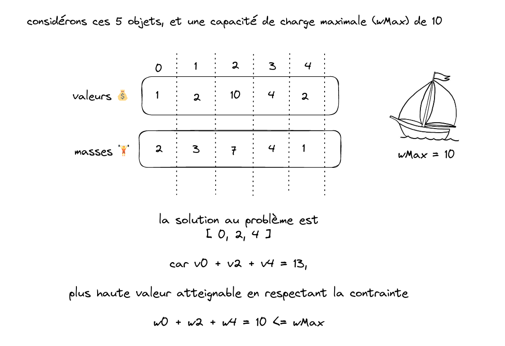

# Pirates, Butin & Optimisation combinatoire

##  Contexte

Vous êtes un équipage de pirates et vous venez de finir l'abordage d'un navire marchand chargé de richesses. Vous ouvrez dans la coque du navire où se trouve le butin: **`N` objets ayant une valeur `V` et une masse `W`**

Naturellement, vous souhaitez **maximiser** les bénéfices de votre _opération_. 

Cependant, vous ne pouvez pas prendre tous les objets avec vous.

Votre bateau ne peut en effet supporter qu'une masse `WMax`.

### Problème: pour quelle combinaison d'objets je **maximise la valeur** de mon butin, tout en restant dans **la limite `WMax`** ?

___

## Principe du challenge

Ce challenge d'algo a 3 niveaux de difficultés:
* papier stylo: 10 objets à traiter
* facile: 100 objets à traiter
* medium: 1000 objets à traiter
* hard : 1M d'objets à traiter

Et peut être réalisé dans les langages suivants:
* python
* java
* c++
* c#
* JS (node)

Le dossier "given_files" contient un fichier "parameters" pour chaque language.
Ce fichier permet de générer les paramètres du problème pour les 3 niveaux de difficultés.

La classe Paramètres contient les attributs suivants:
* itemWeights: liste de N entiers représentant les masses des objets
* itemValues: liste de N entiers représentant les valeurs des objets
* maxWeightCapacity: masse maximale à ne pas dépasse

Votre algorithme doit renvoyer 3 valeurs:
* une liste d'entiers: les indices des objets que vous sélectionnez dans les tableaux. **Cette liste doit être triée en ordre croissant**
* la somme des valeurs des objets sélectionnés
* la somme des masses des objets sélectionnés

> Par exemple, si on a
> * itemWeights = [ 1, 2, 3, 4, 5 ]
> * itemValues = [ 5, 4, 3, 2, 1 ]
> * maxWeight = 6

> Alors votre algo renverra 3 valeurs: 
> * items: [ 0, 1, 2 ]
> * value: 12
> * weight: 6

> évidemment, les données d'entrée sont les même pour tous les langages.

L'objectif de votre équipe est de marquer **le + de points possibles**. Les points se marquent en remplissant les challenges de cette liste. Certains challenges se basent sur la **rapidité**, d'autres sur la **performance** ou le soin apporté à **l'algorithmie**.

|  Categorie | Objectif  |  Points  | 
| --- | --- | --- | 
| rapidité | Première équipe à trouver la solution en difficulté "easy"  |  1  |
| rapidité | Première équipe à trouver la solution en difficulté "moyen"  |  1  |
| rapidité | Première équipe à trouver la solution à 5% près en difficulté "hard"  |  2  |
| rapidité | Première équipe à trouver la solution en difficulté "hard"  |  3  |
| algo | Montrer (et expliquer!) un algorithme qui résoud le problème avec une complexité inferieure à O(2^n) | 2
| performance | Meilleur temps d'éxécution pour la difficulté medium à la fin du challenge | 2
| performance | Meilleur temps d'éxécution pour la difficulté hard à la fin du challenge | 2
| ??? | Première équipe à trouver le message caché 👀 | 5

> pour les objectifs liés à la performance, à vous d'implémenter des fonctions pour mesurer le temps d'éxécution !

Le top 3 remportera des prix exclusifs, en plus de l'amour éternel de Julien Guisset 

Leaderboard: https://keepthescore.co/board/czsyxkzjsxcdr/